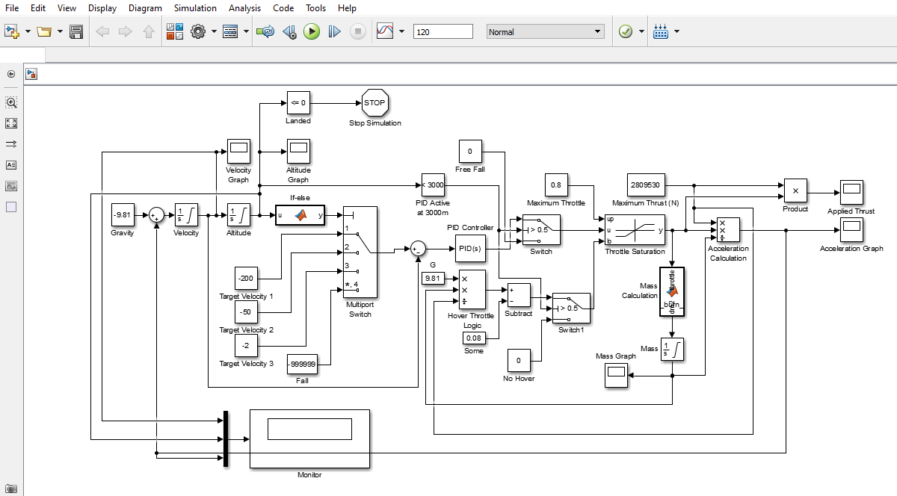
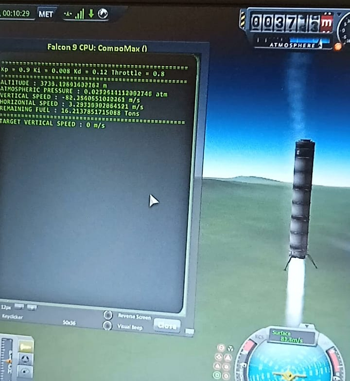
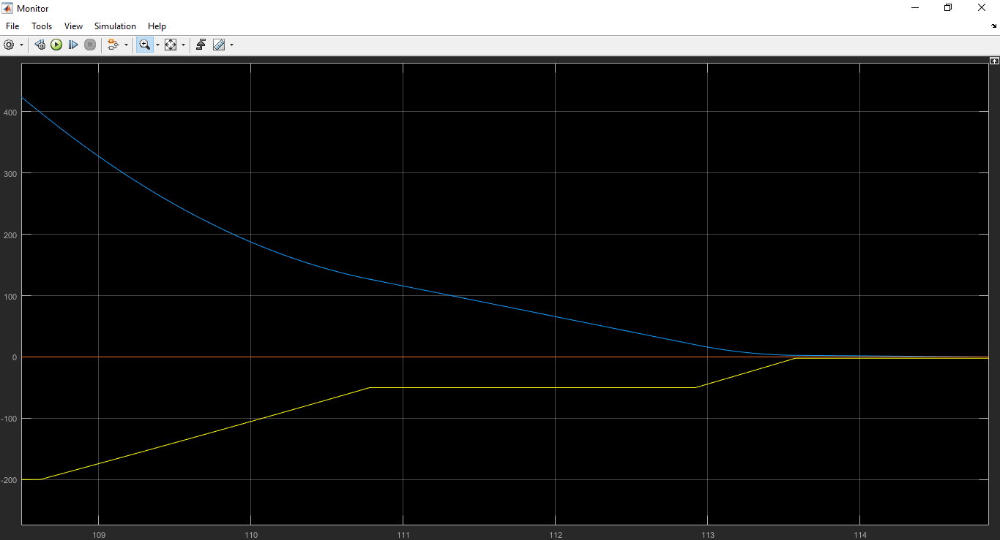
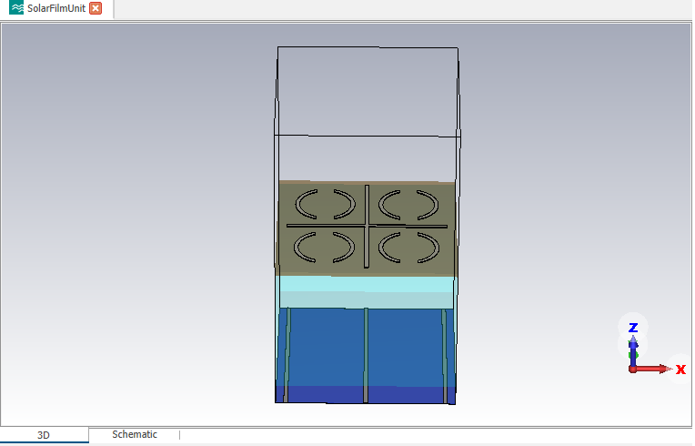
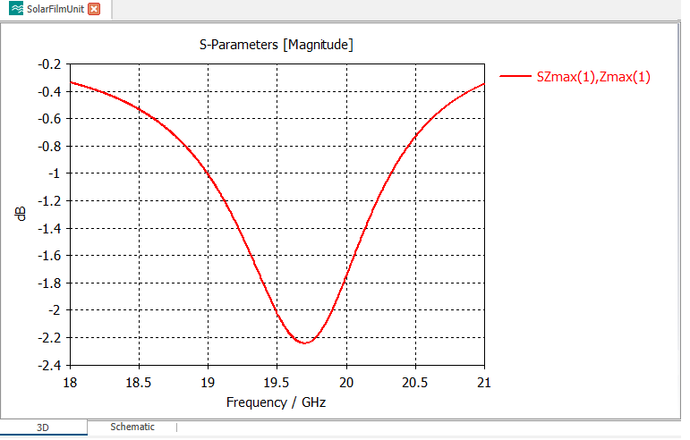
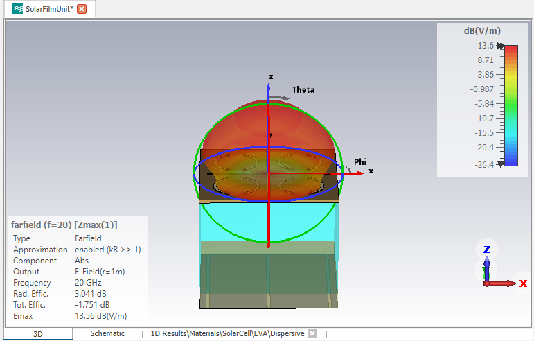
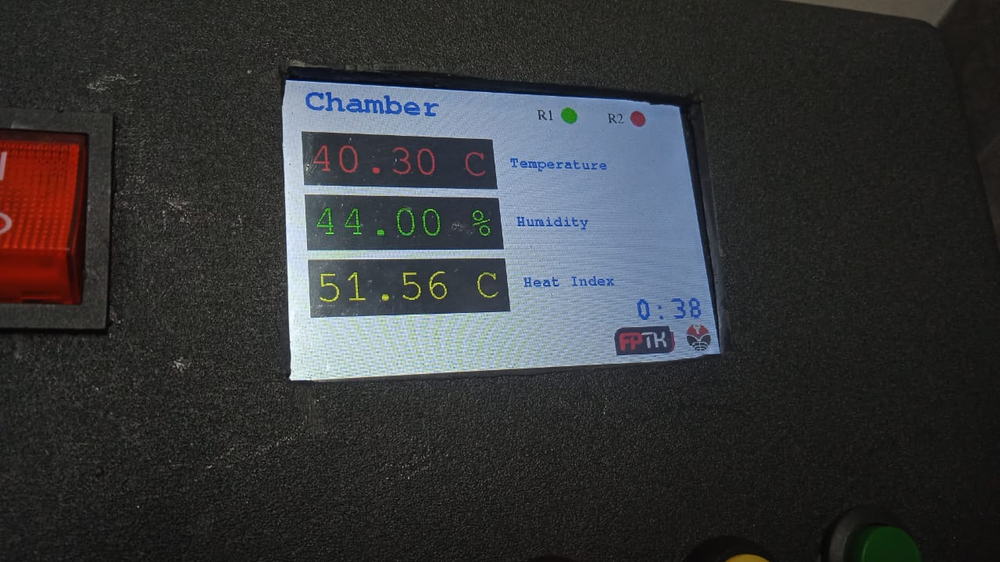
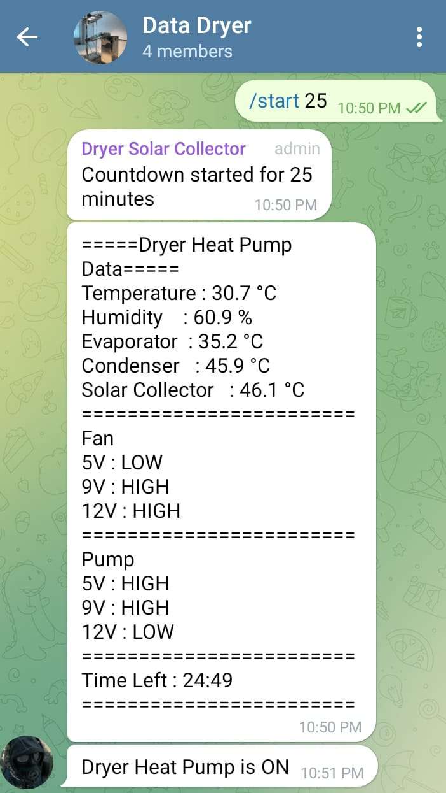

I am an Electrical Engineering undergraduate at UPI Bandung specializing in Telecommunications, Embedded Systems, and Control Logic. I build and simulate robust systems designed for high-reliability environments.

Below is a detailed breakdown of my key engineering projects, highlighting my hands-on expertise in:
* Closed-Loop Control Systems: Aerospace flight dynamics and PID tuning via MATLAB/Simulink.
* RF & Electromagnetic Engineering: Multi-layer dielectric analysis and reflectarray design via CST.
* System Integration: Bridging software logic with physical simulations and hardware.

---

## Aerospace PID Control Simulation

**Role:** Lead Developer  
**Tools & Technologies:** MATLAB, Simulink, Python, Kerbal Space Program (KSP), kOS   
**Focus:** Closed-Loop Control Systems, Flight Dynamics, Telemetry Processing  

### 1. Objective
To design and simulate a closed-loop PID (Proportional-Integral-Derivative) control system capable of autonomously managing a rocket's launch trajectory and executing a propulsive, thrust-vectored landing sequence (similar to the Falcon 9). 

### 2. System Architecture & Control Logic
The core challenge of this project was maintaining the rocket's stability against atmospheric drag and gravity during descent. The system relies on real-time telemetry data to adjust engine thrust and gimbal angles.

* **Proportional (P):** Calculates the immediate error between the current altitude/velocity and the target landing parameters.
* **Integral (I):** Accumulates past errors to correct steady-state offsets (ensuring the rocket doesn't hover just above the pad).
* **Derivative (D):** Predicts future errors based on the rate of descent, preventing overcorrection and catastrophic lithobraking (crashing).

### 3. Simulation Environment (Hardware-in-the-Loop Concept)
To test the control logic without a physical rocket, I first designed the simulation in MATLAB, then moved to 3D simulation in KSP by using kOS as it's automated script controller. KSP acted as the physics engine, feeding real-time altitude, velocity, and pitch data to the controller, which then sent throttle and steering commands back to kOS.

### 4. Results & Telemetry
The finely tuned PID controller successfully stabilized the descent vector and managed the suicide-burn timing, resulting in a fully autonomous, soft touchdown. In the telemetry plot below (where the X-axis represents time and the Y-axis represents magnitude), the blue line shows the altitude of the rocket, while the yellow line shows the velocity. As the rocket gets closer to the ground, it falls slower and finally lands softly at 0 m/s.

---

## SOLANT: Solar Cell Integrated Patch Antenna (Reflectarray Unit Cell)

**Role:** Undergraduate Researcher / RF & Antenna Designer  
**Tools & Technologies:** CST Microwave Studio, Electromagnetic (EM) Theory, Multi-layer Dielectric Analysis  
**Focus:** RF Simulation, Impedance Matching, Reflectarray Optimization  

### 1. Project Context & Objective
This project serves as an experimental foundation for my ongoing academic research into hybrid RF/solar systems. As part of my deep dive into mastering CST Microwave Studio, the primary objective is to simulate and validate the electromagnetic behavior of a high-frequency patch antenna integrated directly onto a commercial solar cell (SOLANT) that operates at 20GHz.

### 2. Antenna Geometry & Dielectric Stackup
The radiating element consists of a specialized copper patch featuring four slitted rings and a central cross. To accurately simulate the real-world electromagnetic behavior, the 3D model in CST required a highly precise multi-layer dielectric stackup:

* **Antenna Patch (Top):** Copper (Cu) radiating element.
* **PET Film:** A thin dielectric carrier layer for the patch prior to glass lamination.
* **Coverglass:** 3.2 mm standard commercial solar glass. With a relative permittivity of εr ≈ 6.7, this thick layer presents a significant RF challenge, historically causing a -2.2 dB reflection loss.
* **EVA (Ethylene Vinyl Acetate):** 0.5 mm adhesive bonding layer.
* **Solar Cell:** Polycrystalline/Monocrystalline Silicon layer. While it absorbs light for power, it acts as a lossy semiconductor in the RF domain, requiring careful simulation to account for EM absorption.
* **Rear Contact (Bottom):** Aluminum (Al) layer that serves a dual purpose: the bottom electrical contact for the solar cell and the RF Ground Plane for the reflectarray.

### 3. Simulation & RF Analysis
Using CST Microwave Studio, I simulated the electromagnetic interactions across the multi-layer stack. Because the silicon is lossy and the thick coverglass has a high dielectric constant (εr), standard free-space antenna calculations do not apply. As demonstrated in the S-Parameter plot, the geometry of the slitted rings and central cross was optimized to compensate for the glass, achieving a resonant frequency near 19.6 GHz with a return loss of approximately -2.25 dB.

### 4. Experimental Results & Future Scope
As an experimental learning model, the simulation successfully mapped the complex EM behavior of the integrated unit cell. It provided a verified baseline for the reflection loss and phase shifts caused by the commercial solar materials. The farfield plot validates the directional radiation pattern at 20 GHz, paving the way for the next phase of my research: scaling this single unit cell into a full, high-gain reflectarray panel capable of simultaneous power generation and telecommunications.

---

## Dryer Heat Pump: Academic Research System (Q1 Scopus)

**Role:** Hardware Programmer & Research Assistant  
**Tools & Technologies:** ESP32, TFT_eSPI, DHT22/DS18B20 Sensors, Thermodynamics  
**Focus:** Environmental Data Acquisition, Local UI/UX, Academic Prototyping  

### 1. Project Context & Objective
Engineered the local control and monitoring architecture for an experimental heat pump drying chamber. This system's data acquisition reliability directly contributed to a successful Q1 Scopus journal publication in *Thermal Science and Engineering Processes*.

### 2. Multi-Zone Thermal Tracking & UI
The system utilizes a custom-programmed, multi-page SPI TFT display to provide researchers with real-time thermodynamic data. 
* **Sensory Array:** Integrates multiple DS18B20 probes and DHT22 sensors to independently track the Compressor, Condenser, Evaporator, and main Chamber.
* **Algorithmic Processing:** The microcontroller actively calculates the internal Heat Index to ensure the thermodynamic properties remain within strict research tolerances.

---

## Solar Dryer Collector: IoT Telemetry System (HKI Registered)

**Role:** Lead Hardware Programmer  
**Tools & Technologies:** ESP32, Telegram Bot API, Wi-Fi Telemetry, C++ Structs  
**Focus:** Non-Blocking IoT Automation, Remote Command Execution, System Documentation  

### 1. Project Context & Objective
Developed the automated control and cloud telemetry system for a hybrid solar drying chamber designed for marine products and stevia leaves. Beyond the hardware deployment, I co-authored the official technical operating manual, successfully securing a government-issued Intellectual Property registration (HKI / Hak Cipta) for the system's documentation.

### 2. Dynamic Relay Matrix & Auto-Shutoff
To maintain optimal thermal efficiency, I programmed a dynamic relay matrix using C++ Struct lookup tables.
* **Variable Control:** The system automatically switches between 5V, 9V, and 12V fans and pumps based on predefined temperature brackets.
* **Failsafe Logic:** Autonomously evaluates humidity levels and terminates the drying cycle when the chamber drops below 20%, preventing over-drying.

### 3. Remote Command via Telegram API
Because agricultural drying cycles span several hours, I integrated a bidirectional Telegram Bot API over Wi-Fi. 
* **Live Logging:** Pushes comprehensive diagnostic logs (temperatures, relay states, and time remaining) to a secure channel every 60 seconds.
* **Remote Execution:** Researchers can send custom text commands (e.g., `/start 30`, `/stop`) to dynamically control the physical machine from anywhere in the world.

